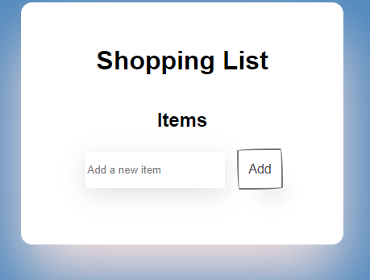

# Shopping List React Project

This is a small React project that implements a shopping list application. Users can add items to the list and remove them as needed.

## Features

- Add new items to the shopping list
- Remove items from the list
- Interactive user interface
- Responsive design

## Technologies Used

- React: JavaScript library for building user interfaces
- CSS: Styling the user interface
## Screenshot

